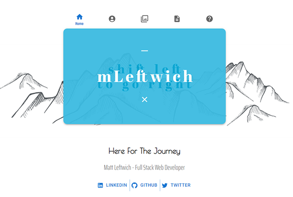

  
  # ShiftLeft Portfolio
  
  ## Table of Contents
  * [Description](#description)
  * [Installation](#installation)
  * [Usage](#usage)
  * [Contributing](#contributing)
  * [Guidelines](#guidelines)
  * [Tests](#tests)
  * [License](#license)
  * [Questions](#questions)
---

  ## Description
  A Portfolio application to showcase my work and provide information about myself and the services I offer. Created using React and Material the app is fully responsive for most viewports and offers a sleek intuitive design. Features a landing page, about section, a resume section with a link to my downloadable resume and a list of proficiencies, a contact form and the portfolio section that shows a few of the projects I've created or been a part of.

  

  ## Installation
   None

  ## Usage
   Visit http://shiftleft.net.au

  ## Contributing
   Not seeking contributions

  ## Guidelines
   None

  ## Tests
   

  ## License
   Licensed under [MIT](https://opensource.org/licenses/MIT) 

   ---

  ## Questions
   For any questions you can find me at [GitHub](https://github.com/mleftwich) or email me at [mleftwich@live.com](mailto:mleftwich@live.com) 
